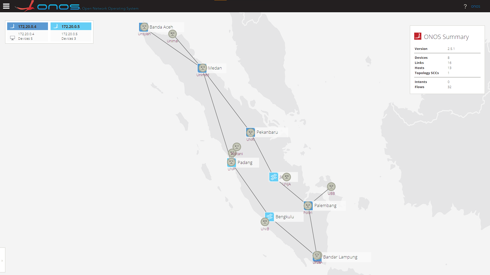

# Automate deploy ONOS cluster with custom topology
This script is intended to automatically deploy an ONOS cluster, original work by [ederollora/ONOS_autocluster](https://github.com/ederollora/ONOS_autocluster)  
Also thanks to [abazh/ONOS_autocluster](https://github.com/abazh/ONOS_autocluster/) for most of the files and lectures  

## Prerequisite (you may skip it if already installed)
- Docker engine installed on your Ubuntu server with a non-user privileges to access all docker commands.  
Use this [link](https://docs.docker.com/engine/install/ubuntu/#install-using-the-convenience-script) to install docker and this [link](https://docs.docker.com/engine/install/linux-postinstall/#manage-docker-as-a-non-root-user) to manage Docker as non-root user
- [Mininet](http://mininet.org/download/#option-3-installation./-from-packages) to create virtual network environment for ONOS.  
If you encounter problem about python-pip or any problem with python version involved, try to install using python3 : `$ PYTHON=python3 mininet/util/install.sh`
- `$ sudo apt install jq python-is-python2`

## Steps to do
1. Run `$ git clone https://github.com/febryandana/ONOS-autocluster-sumatera.git`
> You may encounter problem when running the script if jq and python2 is not install on your server
> Just install the dependencies `$ sudo apt install jq python-is-python2`
2. Go the directory `$ cd ONOS-autocluster-sumatera`
3. Create ONOS cluster (by default 2 instances) `$ ./create_cluster.sh`
4. Set sshkey and env parameters `$ ./set_env_sshkey.sh`
5. Check environment variables using `$ env` 
> Make sure there are ONOS variables (ONOS_INSTANCES, OCI, OC1, OC2, ONOS_ROOT, ONOS_BIN, and PATH to ~/onos/bin)
6. If you cant find them, try `$ ./onos_env.sh` to reload the source file.  

## Create topology using sumatera-map.py
> sumatera-map.py consists of 8 switches and 13 hosts that represent cities and universities in Sumatera, Indonesia  

- You can use [Tmux](https://github.com/tmux/tmux/wiki) to easily switch between program without closing the program. It's useful when used with mininet so that the mininet console won't disconnect.  
- Make sure that Docker containers for ONOS and Atomix are up & running. Check using `$ docker ps -a`  

1. Go to directory `$ cd ONOS_autocluster`
2. Run the onos-netfcg `$ onos-netcfg $OC1 sumatera-map.json`
> This json file contain label names and locations of the switches and hosts in ONOS. You may changes this file if want to create your own topology
3. Run the example topology `$ sudo python3 sumatera-map.py $ONOS_INSTANCES`
> This python file contain code to build ONOS topology. You may changes this file based on your own json file for other topology
4. To try the connection between host, run `> pingall` or `> h1 ping h5` in the mininet console
> It should resulted as error or 100% dropped because we did not activate forwarding apps in ONOS yet
5. On the other terminal, run `$ onos`
> It will direct you to ONOS CLI, you can just press TAB to see other command completion
6. You may activate the necessary ONOS app like `$ app activate fwd` for enabling Reactive Forwarding or checking paths between two switches `$ paths --disjoint of:0000000000000001 of:0000000000000003`
8. Use CTRL+D or `$ logout` to disconnect from ONOS CLI
9. Go to ONOS GUI with your web browser to open http://[your_ip_address or localhost]:8181/onos/ui
> Default username and password for ONOS:  
Username: onos  
Password: rocks  
